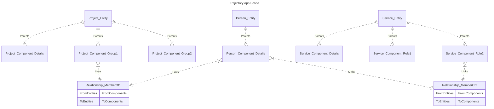
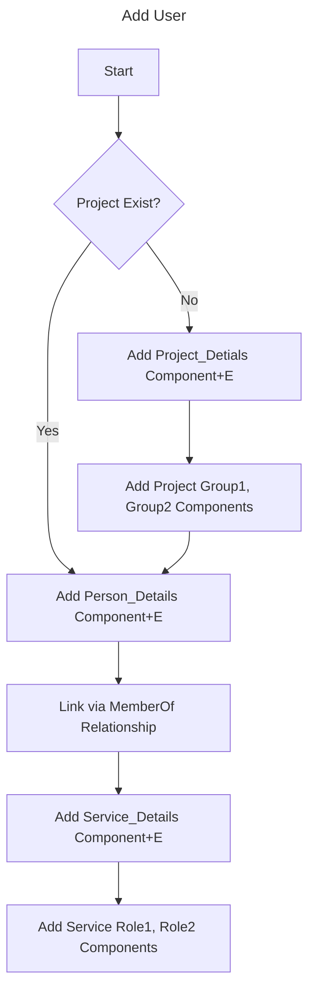

# Trajectory Modeling

https://mermaid.js.org/syntax/gantt.html

```mermaid
---
title: Trajectory App Scope
---
erDiagram
    Person_Entity ||..|{ Person_Component_Details : Parents
    Project_Entity ||..|{ Project_Component_Details:Parents
    Project_Entity ||..|{ Project_Component_Group1:Parents
    Project_Entity ||..|{ Project_Component_Group2:Parents
    Service_Entity ||..|{ Service_Component_Details:Parents
    Service_Entity ||..|{ Service_Component_Role1:Parents
    Service_Entity ||..|{ Service_Component_Role2:Parents
    Project_Component_Group1 }|..|| Relationship_MemberOf1 : Links
    Person_Component_Details }|..|| Relationship_MemberOf1 : Links
    
    Relationship_MemberOf1 {
            FromEntities
            FromComponents
            ToEntities
            ToComponents
        }
        Relationship_MemberOf2 {
            FromEntities
            FromComponents
            ToEntities
            ToComponents
        }
    Service_Component_Role2 }|..|| Relationship_MemberOf2 :Links
    Person_Component_Details }|..|| Relationship_MemberOf2 :Links
```

```mermaid
---
title: Add User
---
flowchart TD
    A[Start] --> B{Project Exist?}
    B --->|Yes| C[Add Person_Details Component+E]
    B -->|No| D[Add Project_Detials Component+E]
    D --> E[Add Project Group1, Group2 Components]
    E --> C
    C --> F[Link via MemberOf Relationship]

    F --> G[Add Service_Details Component+E]
    G --> H[Add Service Role1, Role2 Components]
```